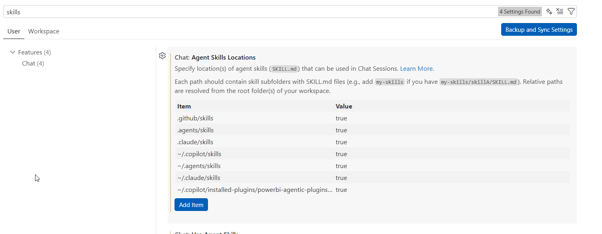

# powerbi-agentic-plugins

## Pre-Requisites

- Install [Fabric CLI](https://microsoft.github.io/fabric-cli/)
- Install [Copilot CLI](https://github.com/features/copilot/cli)
- Download or Install [Power BI Modeling MCP](https://github.com/microsoft/powerbi-modeling-mcp)

## Copilot CLI setup

- Register the Power BI Modeling MCP using `/mcp add` command
    - name: powerbi-modeling-mcp
    - type: stdio
    - command: [path to mcp server download folder]\powerbi-modeling-mcp.exe --start
- Install the plugins
    ```
    /plugin marketplace add RuiRomano/powerbi-plugins
    /plugin install powerbi-plugin@powerbi-plugins
    ```
  
## VS Code setup

Configure [VS Code skills](vscode://settings/chat.agentSkillsLocations) to the skill folder:




## Scenarios

### New Direct Lake semantic model on top of Lakehouse tables

- Create a new Lakehouse in Fabric
- Load it with sample retail data
- Prompt
    ```
    Create a new direct lake semantic model in workspace [workspace] that uses the tables from lakehouse [lakehouse]
    ```

## No Warranty / Limitation of Liability

This software is provided “as is” without warranties or conditions of any kind, either express or implied. Microsoft shall not be liable for any damages arising from use, misuse, or misconfiguration of this software.

## Code of Conduct

This project has adopted the [Microsoft Open Source Code of Conduct](https://opensource.microsoft.com/codeofconduct/). For more information, see the [Code of Conduct FAQ](https://opensource.microsoft.com/codeofconduct/faq/) or contact [open@microsoft.com](mailto:open@microsoft.com) with any additional questions or comments.
